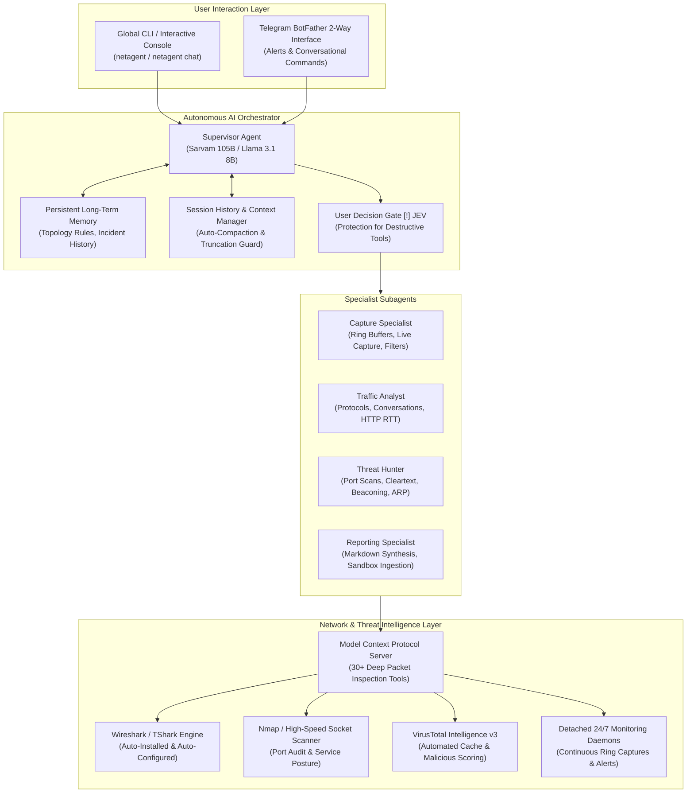
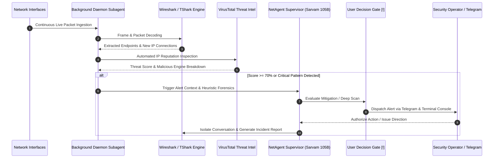

# NetAgent: Autonomous AI Network Defense & Packet Forensics Sentinel

<div align="center">

[](https://opensource.org/licenses/MIT)
[](https://python.org)
[](https://github.com)
[](https://modelcontextprotocol.io)
[](https://dashboard.sarvam.ai)
[](https://ollama.ai)
[](https://virustotal.com)
[](https://telegram.org)
[](https://wireshark.org)
[](https://nmap.org)

```text
███╗   ██╗███████╗████████╗ █████╗  ██████╗ ███████╗███╗   ██╗████████╗
████╗  ██║██╔════╝╚══██╔══╝██╔══██╗██╔════╝ ██╔════╝████╗  ██║╚══██╔══╝
██╔██╗ ██║█████╗     ██║   ███████║██║  ███╗█████╗  ██╔██╗ ██║   ██║   
██║╚██╗██║██╔══╝     ██║   ██╔══██║██║   ██║██╔══╝  ██║╚██╗██║   ██║   
██║ ╚████║███████╗   ██║   ██║  ██║╚██████╔╝███████╗██║ ╚████║   ██║   
╚═╝  ╚═══╝╚══════╝   ╚═╝   ╚═╝  ╚═╝ ╚═════╝ ╚══════╝╚═╝  ╚═══╝   ╚═╝   
     ⚡ Autonomous AI Network Defense, Traffic Sentinel & Packet Forensics ⚡
```

**NetAgent** is an enterprise-grade autonomous AI network sentry powered by the **Model Context Protocol (MCP)**, **Sarvam AI** cloud intelligence (or local **Ollama**), and the **Wireshark / TShark** packet dissection engine. It conducts live network monitoring across physical and virtual interfaces, runs detached background surveillance daemons, executes sandbox pcap threat analysis, queries VirusTotal threat intelligence for newly connected IP addresses, and provides instant critical alerting via 2-way Telegram bot integration.

</div>

---

## ⚡ System Architecture



---

## ⚡ Threat-Hunting & Incident Response Pipeline



---

## ⚡ Terminal GUI Interface Mockups

NetAgent features a modern, responsive Unicode terminal interface built for cybersecurity operators, network architects, and SOC teams.

### 1. Interactive AI Defense Console & Live Telemetry

```text
╭─────────────────────────────── NetAgent AI Security Console ────────────────────────────────╮
│ Provider: Sarvam AI (Cloud) | Mode: multi-agent | Supervisor: sarvam-105b                   │
│ Active Session: default_investigation           | User Decision Gate: ON [!]                │
│ Capture Engine: Wireshark/TShark 4.4.0          | Interfaces Monitored: 15 active           │
╰─────────────────────────────────────────────────────────────────────────────────────────────╯

You: Investigate the suspicious outbound connection on interface eth0

 ⚡ capture › Start live packet capture
   ↳ start_capture(interface="eth0", duration_seconds=15, bpf_filter="not port 22")
 ⚡ pcap › Decode captured stream
   ↳ analyze_conversations(capture_id="c1_49102")
 ⚡ intel › Query threat reputation for remote endpoint
   ↳ virustotal_ip_report(ip="185.220.101.5")

╭──────────────────────────────────────── NetAgent ───────────────────────────────────────────╮
│ [ALERT] Threat Assessment: Outbound Tor Exit Node Beaconing Detected                        │
│                                                                                             │
│ Telemetry Analysis:                                                                         │
│  • Endpoint: 185.220.101.5 (Port 443 / TLS 1.3)                                            │
│  • VirusTotal Malicious Score: 84% (16 / 19 security engines flagged as Malicious)          │
│  • Autonomous Findings: Periodic beacon intervals observed (every 45s, jitter: 1.2s)       │
│  • Organization: Tor Relay Network / Anonymous Proxy                                        │
│                                                                                             │
│ Next-Step Decision Options:                                                                 │
│  1 Isolate interface traffic and terminate background socket stream                         │
│  2 Run detailed port & service vulnerability scan on local origin host                      │
│  3 Generate comprehensive forensic markdown report in data/reports/                         │
│  4 Export captured pcap directly to desktop Wireshark GUI                                   │
╰─────────────────────────────────────────────────────────────────────────────────────────────╯
```

### 2. User Decision Confirmation Gate

```text
╭────────────────────────────────── User Decision Required ───────────────────────────────────╮
│ [!] Action Confirmation Gate                                                                │
│                                                                                             │
│ The agent requested execution of: stop_all_captures(grace_period=5)                         │
│ Description: Immediately terminates all active background network capture jobs.             │
╰─────────────────────────────────────────────────────────────────────────────────────────────╯
? Execute this action? (Use ↑/↓ and Enter)
  > Yes (Approve and execute)
    No  (Decline this action)
    Always allow this tool in session
```

### 3. Continuous 24/7 Monitoring Subagent Dashboard

```text
╭────────────────────────── NetAgent Continuous Monitoring Ledger ────────────────────────────╮
│ ID          Name              Interface    Status      Packets   Alerts   Capture File      │
│ ─────────────────────────────────────────────────────────────────────────────────────────── │
│ mon_a8910   Gateway Watchdog  Ethernet     [RUNNING]    84,219        2   mon_a8910.pcap    │
│ mon_c2301   WLAN Sentinel     Wi-Fi        [RUNNING]    31,402        0   mon_c2301.pcap    │
│ mon_f9942   Lab Perimeter     vEthernet    [STOPPED]     4,110        0   mon_f9942.pcap    │
╰─────────────────────────────────────────────────────────────────────────────────────────────╯
```

### 4. VirusTotal Threat Intelligence Telemetry Panel

```text
╭────────────────────────── VirusTotal Threat Intelligence Report ────────────────────────────╮
│ Target IP Address:    185.220.101.5                                                         │
│ Threat Verdict:       [ALERT] HIGH-RISK MALICIOUS (Score: 84%)                              │
│ Engine Detections:    16 malicious / 19 clean / 0 suspicious                                │
│ Autonomous Decision:  CRITICAL ALERT DISPATCHED OVER TELEGRAM SENTINEL                      │
│ Autonomous Org / ASN: AS60729 (Zwiebelfreunde e.V.) - Germany                               │
│ Last Analysis Date:   2026-09-26 22:54:10 UTC                                               │
╰─────────────────────────────────────────────────────────────────────────────────────────────╯
```

### 5. JEV Port Scanner & Posture Assessment Panel

```text
╭────────────────────────── NetAgent Port & Service Posture Audit ────────────────────────────╮
│ Target Host:  192.168.1.1 (Default Gateway)          | Scanner: Nmap Engine / Socket        │
│ Scan Type:    Comprehensive TCP Syn / Service Audit  | Duration: 4.8s                       │
│ ─────────────────────────────────────────────────────────────────────────────────────────── │
│ PORT    STATE    SERVICE      VERSION                RISK LEVEL      REMARK                 │
│ 22/tcp  open     ssh          OpenSSH 9.2p1          LOW             Key auth enforced      │
│ 53/tcp  open     domain       dnsmasq 2.89           LOW             Standard DNS resolver  │
│ 80/tcp  open     http         lighttpd 1.4.69        MEDIUM          Unencrypted web admin  │
│ 443/tcp open     https        lighttpd (TLS 1.3)     LOW             HSTS enabled           │
│ 8080/tcp open    http-proxy   MiniUPnPd 2.3.3        HIGH [!]        UPnP exposed to LAN    │
│                                                                                             │
│ JEV Posture Recommendation: Disable UPnP service on port 8080 to prevent traversal.        │
╰─────────────────────────────────────────────────────────────────────────────────────────────╯
```

---

## ⚡ Key Features

- **No Pre-Installed Tools Assumed**: NetAgent's installer checks for Wireshark, TShark, Npcap, and Nmap. If any tool is absent, it pulls and installs it automatically via official package managers (`winget`, `choco`, `apt`, `dnf`, `pacman`) or silent official vendor installers.
- **Dual AI Provider Architecture**:
  - **Sarvam AI (Cloud)**: Massive reasoning power via Indian foundation models (`sarvam-105b` Supervisor and `sarvam-105b-conversations` Specialists).
  - **Ollama (Local)**: Air-gapped, offline operation with zero data leaving your machine (`llama3.1:8b` Supervisor and `llama3.2:3b` Specialists).
- **Detached 24/7 Subagent Daemons**: Spawn background packet monitoring processes that continue running even after your terminal window is closed. Inspect subagent statistics, live packet counters, and alert ledgers at any time from any terminal.
- **Integrated VirusTotal Intelligence**: Automatically checks all newly connected external IP addresses against VirusTotal. Alerts operator via console and Telegram when threat score threshold (>= 70%) is exceeded.
- **2-Way Telegram Bot Interface**: Receive real-time mobile push notifications for critical threats, and manage NetAgent remotely via slash commands (`/monitors`, `/stats`, `/check <ip>`, `/alerts`).
- **JEV Autonomous Decision Engine**: Intelligent host auditing, port scanning, and automated next-step option extraction.
- **Isolated Directory Separation**:
  - Live packet captures stream to project `/capture`.
  - Extracted artifacts, reports, memory, sessions, and quarantine files stream to project `/data`.
- **Persistent Long-Term Memory & Saved Sessions**: Preserves environment knowledge, baseline network topology, and incident history across reboots.

---

## ⚡ Installation & Setup

### PowerShell (Windows 10 / 11)

Open PowerShell as Administrator and run:

```powershell
# 1. Clone repository and navigate to folder
cd C:\path\to\NetAgent-main

# 2. Run one-click setup script (auto-detects and installs Wireshark, Nmap, dependencies & registers global command)
python setup_netagent.py --api-key YOUR_SARVAM_API_KEY --telegram-token YOUR_BOT_TOKEN --telegram-chat-id YOUR_CHAT_ID --virustotal-key YOUR_VT_KEY

# 3. Close this PowerShell window and open a NEW one (PATH changes never
#    apply to a window that was already open), then run:
netagent
```

---

### Linux (Ubuntu / Debian / Kali / Fedora / Arch / openSUSE)

NetAgent fully supports Linux environments for autonomous packet captures, live interface inspection, and threat hunting. Follow either the **One-Click Automated Setup** or the **Manual Step-by-Step Installation**.

#### Option A: One-Click Automated Setup (Recommended)

The included `setup_netagent.py` installer automatically detects your Linux distribution, installs missing tools (`tshark`, `wireshark`, `dumpcap`, `nmap`, `tcpdump`, `iproute2`, `psutil`), configures non-root packet capture permissions, sets up long-term memory, and registers global executable shims:

```bash
# 1. Clone repository and navigate to directory
git clone https://github.com/your-username/NetAgent.git ~/NetAgent
cd ~/NetAgent

# 2. Create and activate a Python virtual environment (Python 3.10+)
python3 -m venv venv
source venv/bin/activate

# 3. Ensure pip build tools and psutil are up to date
pip install --upgrade pip setuptools wheel psutil

# 4. Run automated one-click setup
python3 setup_netagent.py

# Optional: Provide API keys directly via flags for unattended setup
# python3 setup_netagent.py \
#   --api-key YOUR_SARVAM_API_KEY \
#   --telegram-token YOUR_BOT_TOKEN \
#   --telegram-chat-id YOUR_CHAT_ID \
#   --virustotal-key YOUR_VT_KEY
```

---

#### Option B: Manual Step-by-Step Linux Installation

If you prefer to configure system packages and dependencies manually:

##### 1. Install System Network & IP Inspection Tools

Choose the command matching your Linux distribution:

* **Ubuntu / Debian / Kali Linux / Linux Mint / Pop!_OS:**
  ```bash
  # Pre-seed debconf so tshark installs non-interactively without blocking prompts
  echo "wireshark-common wireshark-common/install-setuid boolean true" | sudo debconf-set-selections

  sudo apt-get update -y
  sudo apt-get install -y tshark wireshark dumpcap nmap tcpdump net-tools iproute2 traceroute libpcap-dev
  ```

* **Fedora / RHEL / CentOS:**
  ```bash
  sudo dnf install -y wireshark wireshark-cli tshark nmap tcpdump net-tools iproute traceroute libpcap-devel
  ```

* **Arch Linux / Manjaro:**
  ```bash
  sudo pacman -S --noconfirm wireshark-cli wireshark-qt nmap tcpdump net-tools iproute2 traceroute libpcap
  ```

* **openSUSE:**
  ```bash
  sudo zypper --non-interactive install wireshark tshark nmap tcpdump net-tools iproute2 traceroute libpcap-devel
  ```

##### 2. Configure Non-Root Live Packet Capture Permissions

> [!IMPORTANT]
> Running NetAgent or packet captures under `sudo` is **strongly discouraged** as it breaks Python virtual environments and creates security risks. Grant your Linux user non-root packet capture capabilities via Linux file capabilities on `dumpcap`:

```bash
# 1. Add current user to wireshark group
sudo usermod -aG wireshark $USER

# 2. Set Linux capabilities on dumpcap (allows raw socket capture without root)
sudo chmod +x /usr/bin/dumpcap
sudo setcap 'CAP_NET_RAW+eip CAP_NET_ADMIN+eip' /usr/bin/dumpcap

# 3. Apply group membership immediately to current shell session (without rebooting)
newgrp wireshark
```

##### 3. Install NetAgent Python Package

```bash
# In your activated virtual environment:
pip install --upgrade pip setuptools wheel psutil
pip install -e .
```

##### 4. Authorize Packet Capture & Verify Environment

```bash
# Pre-authorize packet capture in NetAgent data directory
mkdir -p data capture
touch capture/.authorized data/.authorized

# Run full diagnostic check
netagent doctor
```

---

#### Setting Up Global Linux Command (`netagent`)

To run `netagent` from any terminal or working directory on Linux:

**Option 1: Add NetAgent User Bin to PATH (Default)**
```bash
# Add to ~/.bashrc or ~/.zshrc
echo 'export PATH="$HOME/.netagent/bin:$PATH"' >> ~/.bashrc
source ~/.bashrc
```

**Option 2: Create System Symlink**
```bash
sudo ln -sf $(pwd)/venv/bin/netagent /usr/local/bin/netagent
```

You can now start NetAgent anywhere:
```bash
netagent
# or
netagent chat
```

---

#### Linux Troubleshooting & Common Issues

* **`tshark: Permission denied` or `There are no interfaces on which a capture can be done`:**
  Your user lacks packet capture permissions. Run:
  ```bash
  sudo usermod -aG wireshark $USER
  sudo setcap 'CAP_NET_RAW+eip CAP_NET_ADMIN+eip' /usr/bin/dumpcap
  newgrp wireshark
  ```
  Then test with: `tshark -D`

* **`ModuleNotFoundError: No module named 'psutil'`:**
  Install `psutil` inside your active virtual environment:
  ```bash
  pip install --upgrade psutil
  ```

* **`BackendUnavailable: Cannot import 'setuptools.build_meta'` during pip install:**
  In modern Python (Python 3.12+ / 3.14 on Linux), fresh virtual environments do not bundle build tools. Run:
  ```bash
  pip install --upgrade pip setuptools wheel
  pip install -e .
  ```

* **Headless Linux Server / SSH Sessions:**
  NetAgent's continuous background monitoring subagents run completely detached as background daemons:
  ```bash
  # Spawn 24/7 background monitor daemon on eth0 (survives SSH disconnects)
  netagent monitor start eth0

  # Check stats and alerts at any time
  netagent monitor list
  netagent monitor stats mon_xxxxxx
  ```

---

## ⚡ Connecting to Claude, Cursor & AI Agents via MCP

NetAgent acts as a high-performance **Model Context Protocol (MCP)** server, making all 58 network packet capture, protocol dissection, VirusTotal threat intelligence, and security audit tools natively available to any external AI agent (Claude Desktop, Claude Code, Cursor, Windsurf, Roo Code, Goose, Gemini CLI).

When an external agent connects over MCP, NetAgent provides:
- **Autonomous Agent Instructions**: Injected automatically during the MCP handshake so the AI immediately understands cybersecurity methodology, tool chaining, and safety rules.
- **58 Fully Annotated Tools**: Complete with typed input schemas, default values, and defensive recommendations.
- **Built-in MCP Prompts**: Reusable guided workflows (`network_triage_guide`, `threat_hunting_playbook`, `host_security_audit`).
- **Live MCP Resources**: Real-time readable endpoints (`netagent://system/status`, `netagent://memory/long-term`, `netagent://threats/virustotal-cache`).

---

### One-Click Auto-Configuration for Claude Desktop

NetAgent can automatically detect and register itself into your Claude Desktop configuration:

```powershell
# Windows PowerShell
netagent mcp install-claude
```

```bash
# Linux / macOS
netagent mcp install-claude
```

Restart Claude Desktop, and NetAgent will appear in the bottom-right tools menu (hammer icon).

---

### Manual Claude Desktop Configuration (`claude_desktop_config.json`)

Add the following block to your Claude Desktop configuration file:
- **Windows**: `%APPDATA%\Claude\claude_desktop_config.json`
- **macOS**: `~/Library/Application Support/Claude/claude_desktop_config.json`
- **Linux**: `~/.config/Claude/claude_desktop_config.json`

```json
{
  "mcpServers": {
    "netagent": {
      "command": "python",
      "args": [
        "-m",
        "wireshark_mcp.server"
      ],
      "env": {
        "SARVAM_API_KEY": "YOUR_SARVAM_API_KEY",
        "VIRUSTOTAL_API_KEY": "YOUR_VIRUSTOTAL_API_KEY",
        "TELEGRAM_BOT_TOKEN": "YOUR_TELEGRAM_BOT_TOKEN",
        "TELEGRAM_CHAT_ID": "YOUR_TELEGRAM_CHAT_ID"
      }
    }
  }
}
```

---

### Claude Code CLI Integration

Connect NetAgent to the official Anthropic Claude Code terminal agent with one command:

```bash
claude mcp add netagent -- python -m wireshark_mcp.server
```

---

### Cursor & Windsurf IDE Integration (`.cursor/mcp.json`)

To enable NetAgent inside Cursor or Windsurf, place a `.cursor/mcp.json` file in your workspace:

```json
{
  "mcpServers": {
    "netagent": {
      "command": "python",
      "args": [
        "-m",
        "wireshark_mcp.server"
      ],
      "env": {
        "SARVAM_API_KEY": "YOUR_SARVAM_API_KEY",
        "VIRUSTOTAL_API_KEY": "YOUR_VIRUSTOTAL_API_KEY"
      }
    }
  }
}
```

---

### Verify MCP Connection & Tools

Verify your MCP server, tools, prompts, and resources from the command line:

```bash
netagent mcp test
```

Expected output:
```text
[OK] MCP Server Handshake Successful!
  • Tools Exposed: 58
  • Prompts Available: 3 (network_triage_guide, threat_hunting_playbook, host_security_audit)
  • Resources Available: 3 (netagent://system/status, netagent://memory/long-term, netagent://threats/virustotal-cache)
```

---

## ⚡ CLI Command Reference

Execute NetAgent commands from any terminal:

| Command | Description |
| :--- | :--- |
| `netagent` | Launch the interactive AI network defense console |
| `netagent chat` | Start interactive multi-agent chat session |
| `netagent doctor` | Verify system prerequisites, TShark path, Npcap, and AI connectivity |
| `netagent captures list` | List all packet capture files stored in `/capture` and `/data` |
| `netagent monitor list` | View all active and stopped continuous monitoring subagents |
| `netagent monitor start <iface>` | Spawn a detached 24/7 background packet capture and sentinel daemon |
| `netagent monitor stats <id>` | Inspect live throughput, packet counts, and alert history for a subagent |
| `netagent monitor stop <id>` | Gracefully terminate a continuous background monitoring subagent |
| `netagent monitor delete <id>` | Remove a monitoring subagent and clean up its metadata |
| `netagent scan <target>` | Perform host & port security audit with JEV posture recommendations |
| `netagent scans` | List all historical host and port scans |
| `netagent scan-result <id>` | View detailed open ports, service versions, and risk levels of a scan |
| `netagent virustotal check <ip>` | Query VirusTotal threat reputation with automated caching |
| `netagent virustotal cache` | Display all cached VirusTotal IP intelligence reports |
| `netagent telegram test` | Verify Telegram BotFather connectivity and send test alert |
| `netagent telegram start` | Launch the 2-way interactive Telegram bot daemon in background |
| `netagent telegram status` | Check status of the background Telegram bot daemon |
| `netagent telegram stop` | Stop the background Telegram bot daemon |
| `netagent telegram bot` | Run the 2-way interactive Telegram bot in the foreground |

---

## ⚡ In-Chat Slash Commands

Use slash commands inside the interactive `netagent` chat:

| Slash Command | Usage | Description |
| :--- | :--- | :--- |
| `/session` | `/session save <name>`<br/>`/session load <name>`<br/>`/session list` | Save or resume named investigation sessions with context history |
| `/memory` | `/memory show`<br/>`/memory add <note>`<br/>`/memory clear` | Inspect or update long-term persistent network topology memory |
| `/sandbox` | `/sandbox list`<br/>`/sandbox import <pcap>` | Stage external suspicious pcaps in quarantine sandbox for safe analysis |
| `/monitor` | `/monitor list`<br/>`/monitor start <iface>`<br/>`/monitor stats <id>` | Manage background continuous surveillance daemons directly from chat |
| `/scan` | `/scan 192.168.1.1 [--bg]` | Audit target host ports with JEV decision engine (foreground or background) |
| `/virustotal` | `/virustotal check <ip>`<br/>`/virustotal cache` | Inspect IP threat score and malicious engine breakdown |
| `/telegram` | `/telegram send <msg>`<br/>`/telegram start`<br/>`/telegram stop` | Dispatch mobile alerts or toggle the interactive 2-way Telegram bot |
| `/subagents` | `/subagents` | View dynamic specialist subagent execution ledger |
| `/wireshark` | `/wireshark [capture_id]` | Open selected pcap file directly in the desktop Wireshark GUI |
| `/adapters` | `/adapters` | Enumerate active network adapters, IP addresses, and link speeds |
| `/connections` | `/connections [established]` | Display live TCP/UDP socket connections and process associations |
| `/confirm` | `/confirm on` / `/confirm off` | Toggle User Decision Gate protection for sensitive operations |
| `/help` | `/help` | Display interactive command and tool reference manual |

---

## ⚡ Directory Structure

```text
ollama-wireshark-mcp-v2/
├── capture/                  # Project-level packet capture storage
│   ├── .authorized           # Pre-authorized capture token
│   └── *.pcap                # Live captures and ring buffers
├── data/                     # Analytical output & persistent storage
│   ├── reports/              # Generated markdown threat reports
│   ├── sandbox/              # Quarantined external pcaps
│   ├── scans/                # Host and port scan ledger
│   ├── sessions/             # Saved chat sessions and context
│   ├── memory/               # Long-term network memory ledger
│   ├── extracted/            # HTTP objects, TLS certs, payload files
│   └── monitors/             # Detached background subagent registry
├── wireshark_mcp/            # Core NetAgent package
│   ├── cli.py                # Command-line interface and chat runner
│   ├── server.py             # MCP server with 30+ tshark analysis tools
│   ├── agents.py             # Multi-agent orchestrator & supervisor
│   ├── virustotal.py         # VirusTotal API v3 threat intelligence
│   ├── telegram.py           # 2-way Telegram BotFather integration
│   ├── scanner.py            # Nmap & socket port auditing engine
│   ├── memory.py             # Persistent memory management
│   ├── session.py            # Session serialization & restoration
│   ├── sandbox.py            # Quarantine sandbox staging
│   └── config.py             # Paths, models, and security configuration
├── config.yaml               # Active workspace configuration
├── pyproject.toml            # Project packaging specification
├── requirements.txt          # Python dependencies
└── setup_netagent.py         # One-click installer & dependency resolver
```

---

## ⚡ Security & Privacy Statement

- **Defensive Focus**: NetAgent is built exclusively for defensive security monitoring, authorized vulnerability assessment, and packet forensics.
- **Action Confirmation Gate**: Destructive actions (deleting captures, terminating capture processes, starting unbounded ring captures) require explicit user consent.
- **Air-Gapped Privacy**: When using the local **Ollama** provider, 100% of telemetry, packets, and analysis remain on your local hardware.

---

<div align="center">
  <b>NetAgent Autonomous AI Network Sentinel</b><br/>
  Designed for Cybersecurity Operators, Network Engineers & Threat Hunters.
</div>
