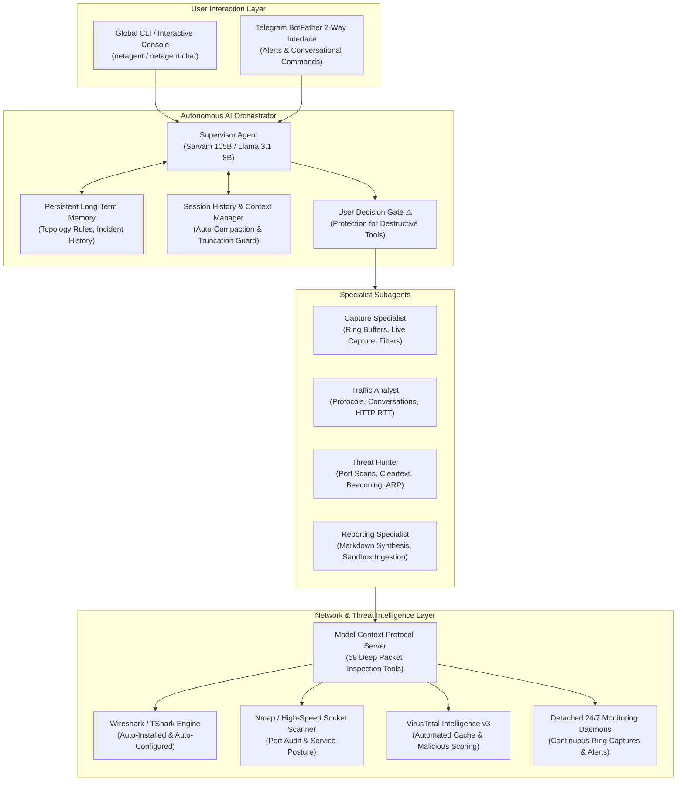

# NetAgent: Autonomous AI Network Defense & Packet Forensics Sentinel

[](https://opensource.org/licenses/MIT)
[](https://python.org)
[](https://github.com)
[](https://modelcontextprotocol.io)
[](https://dashboard.sarvam.ai)
[](https://ollama.ai)
[](https://virustotal.com)
[](https://telegram.org)
[](https://wireshark.org)
[](https://nmap.org)

```
███╗   ██╗███████╗████████╗ █████╗  ██████╗ ███████╗███╗   ██╗████████╗
████╗  ██║██╔════╝╚══██╔══╝██╔══██╗██╔════╝ ██╔════╝████╗  ██║╚══██╔══╝
██╔██╗ ██║█████╗     ██║   ███████║██║  ███╗█████╗  ██╔██╗ ██║   ██║
██║╚██╗██║██╔══╝     ██║   ██╔══██║██║   ██║██╔══╝  ██║╚██╗██║   ██║
██║ ╚████║███████╗   ██║   ██║  ██║╚██████╔╝███████╗██║ ╚████║   ██║
╚═╝  ╚═══╝╚══════╝   ╚═╝   ╚═╝  ╚═╝ ╚═════╝ ╚══════╝╚═╝  ╚═══╝   ╚═╝
     ⚡ Autonomous AI Network Defense, Traffic Sentinel & Packet Forensics ⚡
```

**NetAgent** is an autonomous AI network sentry powered by the **Model Context Protocol (MCP)**, **Sarvam AI** cloud intelligence (or fully local **Ollama**), and the **Wireshark / TShark** packet dissection engine. It performs live network monitoring across physical and virtual interfaces, runs detached 24/7 background surveillance daemons, executes sandboxed pcap threat analysis, queries VirusTotal threat intelligence for newly connected IP addresses, and delivers instant alerting via a 2-way Telegram bot.

---

## ⚡ System Architecture



---

## ⚡ Threat-Hunting & Incident Response Pipeline


---

## ⚡ Terminal Interface Preview

NetAgent features a modern, responsive Unicode terminal interface built for security operators, network architects, and SOC teams.

### 1. Interactive AI Defense Console & Live Telemetry

```
╭─────────────────────────────── NetAgent AI Security Console ────────────────────────────────╮
│ Provider: Sarvam AI (Cloud) | Mode: multi-agent | Supervisor: sarvam-105b                    │
│ Active Session: default_investigation           | User Decision Gate: ON ⚠                  │
│ Capture Engine: Wireshark/TShark 4.4.0          | Interfaces Monitored: 15 active            │
╰───────────────────────────────────────────────────────────────────────────────────────────────╯

You: Investigate the suspicious outbound connection on interface eth0

 ⚡ capture › Start live packet capture
   ↳ start_capture(interface="eth0", duration_seconds=15, bpf_filter="not port 22")
 ⚡ pcap › Decode captured stream
   ↳ analyze_conversations(capture_id="c1_49102")
 ⚡ intel › Query threat reputation for remote endpoint
   ↳ virustotal_ip_report(ip="185.220.101.5")

╭──────────────────────────────────────── NetAgent ────────────────────────────────────────────╮
│ [ALERT] Threat Assessment: Outbound Tor Exit Node Beaconing Detected                         │
│                                                                                                │
│ Telemetry Analysis:                                                                           │
│  • Endpoint: 185.220.101.5 (Port 443 / TLS 1.3)                                               │
│  • VirusTotal Malicious Score: 84% (16 / 19 security engines flagged as Malicious)            │
│  • Autonomous Findings: Periodic beacon intervals observed (every 45s, jitter: 1.2s)          │
│  • Organization: Tor Relay Network / Anonymous Proxy                                          │
│                                                                                                │
│ Next-Step Decision Options:                                                                   │
│  1. Isolate interface traffic and terminate background socket stream                          │
│  2. Run detailed port & service vulnerability scan on local origin host                       │
│  3. Generate comprehensive forensic markdown report in data/reports/                           │
│  4. Export captured pcap directly to desktop Wireshark GUI                                     │
╰────────────────────────────────────────────────────────────────────────────────────────────────╯
```

### 2. User Decision Confirmation Gate

```
╭────────────────────────────────── User Decision Required ────────────────────────────────────╮
│ ⚠ Action Confirmation Gate                                                                    │
│                                                                                                │
│ The agent requested execution of: stop_all_captures(grace_period=5)                            │
│ Description: Immediately terminates all active background network capture jobs.               │
╰────────────────────────────────────────────────────────────────────────────────────────────────╯
? Execute this action? (Use ↑/↓ and Enter)
  > Yes (Approve and execute)
    No  (Decline this action)
    Always allow this tool in session
```

### 3. Continuous 24/7 Monitoring Subagent Dashboard

```
╭────────────────────────── NetAgent Continuous Monitoring Ledger ─────────────────────────────╮
│ ID          Name              Interface    Status      Packets   Alerts   Capture File        │
│ ──────────────────────────────────────────────────────────────────────────────────────────── │
│ mon_a8910   Gateway Watchdog  Ethernet     [RUNNING]    84,219        2   mon_a8910.pcap      │
│ mon_c2301   WLAN Sentinel     Wi-Fi        [RUNNING]    31,402        0   mon_c2301.pcap      │
│ mon_f9942   Lab Perimeter     vEthernet    [STOPPED]     4,110        0   mon_f9942.pcap      │
╰────────────────────────────────────────────────────────────────────────────────────────────────╯
```

### 4. VirusTotal Threat Intelligence Panel

```
╭────────────────────────── VirusTotal Threat Intelligence Report ─────────────────────────────╮
│ Target IP Address:    185.220.101.5                                                          │
│ Threat Verdict:       [ALERT] HIGH-RISK MALICIOUS (Score: 84%)                                │
│ Engine Detections:    16 malicious / 19 clean / 0 suspicious                                  │
│ Autonomous Decision:  CRITICAL ALERT DISPATCHED OVER TELEGRAM SENTINEL                         │
│ Autonomous Org / ASN: AS60729 (Zwiebelfreunde e.V.) - Germany                                  │
╰────────────────────────────────────────────────────────────────────────────────────────────────╯
```

### 5. JEV Port Scanner & Posture Assessment Panel

```
╭────────────────────────── NetAgent Port & Service Posture Audit ─────────────────────────────╮
│ Target Host:  192.168.1.1 (Default Gateway)          | Scanner: Nmap Engine / Socket          │
│ Scan Type:    Comprehensive TCP Syn / Service Audit  | Duration: 4.8s                          │
│ ──────────────────────────────────────────────────────────────────────────────────────────── │
│ PORT    STATE    SERVICE      VERSION                RISK LEVEL      REMARK                   │
│ 22/tcp  open     ssh          OpenSSH 9.2p1          LOW             Key auth enforced         │
│ 53/tcp  open     domain       dnsmasq 2.89           LOW             Standard DNS resolver      │
│ 80/tcp  open     http         lighttpd 1.4.69        MEDIUM          Unencrypted web admin      │
│ 443/tcp open     https        lighttpd (TLS 1.3)     LOW             HSTS enabled               │
│ 8080/tcp open    http-proxy   MiniUPnPd 2.3.3        HIGH ⚠          UPnP exposed to LAN         │
│                                                                                                │
│ JEV Posture Recommendation: Disable UPnP service on port 8080 to prevent traversal.            │
╰────────────────────────────────────────────────────────────────────────────────────────────────╯
```

---

## ⚡ Key Features

- **No Pre-Installed Tools Assumed** — the installer checks for Wireshark, TShark, Npcap/libpcap, and Nmap. Anything missing is pulled and installed automatically via the platform's official package manager (`winget`, `choco`, `apt`, `dnf`, `pacman`, `zypper`, `brew`) or a silent official vendor installer.
- **Dual AI Provider Architecture**
  - **Sarvam AI (Cloud)** — reasoning via `sarvam-105b` (supervisor) and `sarvam-105b-conversations` (specialists), no local GPU required.
  - **Ollama (Local)** — fully air-gapped, offline operation with `llama3.1:8b` (supervisor) and `llama3.2:3b` (specialists); zero data leaves your machine.
- **Detached 24/7 Subagent Daemons** — spawn background packet-monitoring processes that keep running after the terminal is closed. Inspect throughput, packet counts, and alert ledgers from any terminal at any time.
- **Integrated VirusTotal Intelligence** — automatically checks newly connected external IP addresses against VirusTotal and alerts (console + Telegram) once the malicious-engine score crosses the configured threshold (default 70%).
- **2-Way Telegram Bot Interface** — real-time mobile push notifications for critical threats, plus remote control via bot commands.
- **JEV Autonomous Decision Engine** — host auditing, port scanning, risk scoring, and automated next-step recommendations.
- **Isolated Directory Separation** — live packet captures stream to `/capture`; reports, memory, sessions, scans, and quarantined pcaps stream to `/data`.
- **Persistent Long-Term Memory & Saved Sessions** — baseline network topology and incident history survive reboots.

---

## ⚡ Installation & Setup

### Windows (PowerShell)

Open PowerShell (Administrator is not required) and run:

```powershell
# 1. Clone the repository
git clone https://github.com/ScriptKiddie913/NetAgent.git
cd NetAgent

# 2. Run the one-click setup script
#    (auto-detects and installs Wireshark, Nmap, dependencies, and
#    registers the global `netagent` command)
python setup_netagent.py --api-key YOUR_SARVAM_API_KEY --telegram-token YOUR_BOT_TOKEN --telegram-chat-id YOUR_CHAT_ID --virustotal-key YOUR_VT_KEY

# 3. Close this PowerShell window and open a NEW one — PATH changes made
#    by an installer never apply to a window that was already open —
#    then run:
netagent
```

---

### Linux (Ubuntu / Debian / Kali / Fedora / Arch / openSUSE)

NetAgent fully supports Linux for autonomous packet captures, live interface inspection, and threat hunting. Use either the **One-Click Automated Setup** or the **Manual Step-by-Step Installation** below.

#### Option A: One-Click Automated Setup (recommended)

`setup_netagent.py` auto-detects your distribution, installs missing tools (`tshark`, `wireshark`, `dumpcap`, `nmap`, `tcpdump`, `iproute2`, `psutil`), configures non-root packet-capture permissions, sets up long-term memory, and registers the global `netagent` command.

```bash
# 1. Clone the repository
git clone https://github.com/ScriptKiddie913/NetAgent.git
cd NetAgent

# 2. Create and activate a Python virtual environment (Python 3.10+)
python3 -m venv venv
source venv/bin/activate

# 3. Make sure pip's build tools are current
pip install --upgrade pip setuptools wheel psutil

# 4. Run the automated setup (will ask for your sudo password to install
#    system packages — run this from a normal, interactive terminal)
python3 setup_netagent.py

# Optional: pass API keys directly for a fully unattended run
# python3 setup_netagent.py \
#   --api-key YOUR_SARVAM_API_KEY \
#   --telegram-token YOUR_BOT_TOKEN \
#   --telegram-chat-id YOUR_CHAT_ID \
#   --virustotal-key YOUR_VT_KEY

# 5. Open a NEW terminal (or `source ~/.bashrc`), then run:
netagent
```

#### Option B: Manual Step-by-Step Linux Installation

**1. Install system network & packet-capture tools**

```bash
# Ubuntu / Debian / Kali / Linux Mint / Pop!_OS
echo "wireshark-common wireshark-common/install-setuid boolean true" | sudo debconf-set-selections
sudo apt-get update -y
sudo apt-get install -y tshark wireshark dumpcap nmap tcpdump net-tools iproute2 traceroute libpcap-dev

# Fedora / RHEL / CentOS
sudo dnf install -y wireshark wireshark-cli tshark nmap tcpdump net-tools iproute traceroute libpcap-devel

# Arch Linux / Manjaro
sudo pacman -S --noconfirm wireshark-cli wireshark-qt nmap tcpdump net-tools iproute2 traceroute libpcap

# openSUSE
sudo zypper --non-interactive install wireshark tshark nmap tcpdump net-tools iproute2 traceroute libpcap-devel
```

**2. Configure non-root live packet-capture permissions**

> Running NetAgent (or packet captures) under `sudo` is **strongly discouraged** — it breaks Python virtual environments and widens your attack surface. Instead, grant `dumpcap` the two Linux capabilities it actually needs:

```bash
# 1. Add your user to the wireshark group
sudo usermod -aG wireshark $USER

# 2. Grant dumpcap raw-capture capabilities (note: ONE comma-separated
#    clause — a space here is invalid and setcap will silently reject it)
sudo chmod +x /usr/bin/dumpcap
sudo setcap cap_net_raw,cap_net_admin+eip /usr/bin/dumpcap

# 3. Apply the new group membership to your CURRENT shell without
#    logging out (a fresh login also works)
newgrp wireshark
```

**3. Install the NetAgent Python package**

```bash
# inside your activated virtual environment
pip install --upgrade pip setuptools wheel psutil
pip install -e .
```

**4. Authorize packet capture & verify the environment**

```bash
mkdir -p data capture
touch capture/.authorized data/.authorized
netagent doctor
```

**5. Put the `netagent` command on PATH**

`setup_netagent.py` does this for you automatically (it writes to `~/.bashrc`, `~/.zshrc`, and `~/.profile`). To do it by hand instead:

```bash
echo 'export PATH="$HOME/.netagent/bin:$PATH"' >> ~/.bashrc
source ~/.bashrc
```

or symlink the console-script entry point straight from your virtualenv:

```bash
sudo ln -sf "$(pwd)/venv/bin/netagent" /usr/local/bin/netagent
```

You can then start NetAgent from anywhere:

```bash
netagent
# or
netagent chat
```

#### Linux Troubleshooting

| Symptom | Fix |
| --- | --- |
| `tshark: Permission denied` / `There are no interfaces on which a capture can be done` | `sudo usermod -aG wireshark $USER && sudo setcap cap_net_raw,cap_net_admin+eip /usr/bin/dumpcap && newgrp wireshark`, then verify with `tshark -D`. |
| `ModuleNotFoundError: No module named 'psutil'` | `pip install --upgrade psutil` inside your active virtual environment. |
| `BackendUnavailable: Cannot import 'setuptools.build_meta'` during `pip install` | Recent Python (3.12+) venvs don't bundle build tools by default: `pip install --upgrade pip setuptools wheel && pip install -e .` |
| `netagent: command not found` right after setup | Open a **new** terminal (or `source ~/.bashrc`) — PATH changes never apply to the shell that ran the installer. |
| `/adapters` or `/connections` return nothing useful | Install `iproute2` (`sudo apt-get install -y iproute2`) — these commands use `ip`/`ss` on Linux instead of PowerShell. |

**Headless Linux server / SSH session?** Background monitors run fully detached and survive disconnects:

```bash
netagent monitor start eth0        # spawn a 24/7 background monitor daemon
netagent monitor list              # check status anytime
netagent monitor stats mon_xxxxxx  # inspect packet counts & alerts
```

---

### macOS

```bash
git clone https://github.com/ScriptKiddie913/NetAgent.git
cd NetAgent
python3 -m venv venv
source venv/bin/activate
pip install --upgrade pip setuptools wheel psutil
python3 setup_netagent.py    # installs Wireshark via Homebrew if missing
netagent
```

---

## ⚡ Connecting to Claude, Cursor & Other AI Agents via MCP

NetAgent is a **Model Context Protocol (MCP)** server, making all 58 packet-capture, protocol-dissection, VirusTotal threat-intelligence, and security-audit tools natively available to any MCP-capable AI agent (Claude Desktop, Claude Code, Cursor, Windsurf, Roo Code, Goose, Gemini CLI, and others).

When an agent connects over MCP, NetAgent provides:

- **Autonomous agent instructions** injected during the MCP handshake, so the model immediately understands methodology, tool chaining, and safety rules.
- **58 fully annotated tools** with typed input schemas, sensible defaults, and defensive recommendations.
- **Built-in MCP prompts** — reusable guided workflows (`network_triage_guide`, `threat_hunting_playbook`, `host_security_audit`).
- **Live MCP resources** — real-time readable endpoints (`netagent://system/status`, `netagent://memory/long-term`, `netagent://threats/virustotal-cache`).

### One-click Claude Desktop configuration

```bash
netagent mcp install-claude
```

Restart Claude Desktop — NetAgent will appear in the tools menu (hammer icon).

### Manual Claude Desktop configuration

Add the following to your Claude Desktop config file:

- **Windows**: `%APPDATA%\Claude\claude_desktop_config.json`
- **macOS**: `~/Library/Application Support/Claude/claude_desktop_config.json`
- **Linux**: `~/.config/Claude/claude_desktop_config.json`

```json
{
  "mcpServers": {
    "netagent": {
      "command": "python",
      "args": ["-m", "wireshark_mcp.server"],
      "env": {
        "SARVAM_API_KEY": "YOUR_SARVAM_API_KEY",
        "VIRUSTOTAL_API_KEY": "YOUR_VIRUSTOTAL_API_KEY",
        "TELEGRAM_BOT_TOKEN": "YOUR_TELEGRAM_BOT_TOKEN",
        "TELEGRAM_CHAT_ID": "YOUR_TELEGRAM_CHAT_ID"
      }
    }
  }
}
```

### Claude Code CLI

```bash
claude mcp add netagent -- python -m wireshark_mcp.server
```

### Cursor / Windsurf (`.cursor/mcp.json`)

```json
{
  "mcpServers": {
    "netagent": {
      "command": "python",
      "args": ["-m", "wireshark_mcp.server"],
      "env": {
        "SARVAM_API_KEY": "YOUR_SARVAM_API_KEY",
        "VIRUSTOTAL_API_KEY": "YOUR_VIRUSTOTAL_API_KEY"
      }
    }
  }
}
```

### Verify the MCP connection

```bash
netagent mcp test
```

```
[OK] MCP Server Handshake Successful!
  • Tools Exposed: 58
  • Prompts Available: 3 (network_triage_guide, threat_hunting_playbook, host_security_audit)
  • Resources Available: 3 (netagent://system/status, netagent://memory/long-term, netagent://threats/virustotal-cache)
```

---

## ⚡ CLI Command Reference

| Command | Description |
| --- | --- |
| `netagent` | Launch the interactive AI network defense console |
| `netagent chat` | Start an interactive multi-agent chat session |
| `netagent server` | Run the MCP server on stdio (for external MCP clients) |
| `netagent authorize` | One-time acknowledgment required before capture tools will run |
| `netagent doctor` | Verify tshark/Nmap/PATH, AI provider connectivity, and permissions |
| `netagent config` | Show the active resolved configuration |
| `netagent captures list` | List packet capture files in `/capture` and `/data` |
| `netagent captures clean --max-age-hours <n>` | Delete captures older than the given age |
| `netagent monitor list` | View all active and stopped continuous monitoring subagents |
| `netagent monitor start <iface>` | Spawn a detached 24/7 background capture & sentinel daemon |
| `netagent monitor stats <id>` | Inspect live throughput, packet counts, and alert history |
| `netagent monitor stop <id>` | Gracefully stop a background monitoring subagent |
| `netagent monitor delete <id>` | Remove a subagent and clean up its metadata |
| `netagent scan <target>` | Host & port security audit with JEV posture recommendations |
| `netagent scans` | List all historical host/port scans |
| `netagent scan-result <id>` | View open ports, service versions, and risk levels of a scan |
| `netagent virustotal check <ip>` | Query VirusTotal threat reputation (cached) |
| `netagent virustotal cache` | Show all cached VirusTotal IP reports |
| `netagent telegram test` | Verify Telegram bot connectivity |
| `netagent telegram alert <message>` | Send a one-off Telegram alert |
| `netagent telegram start` | Launch the 2-way Telegram bot daemon in the background |
| `netagent telegram status` | Check status of the background Telegram bot daemon |
| `netagent telegram stop` | Stop the background Telegram bot daemon |
| `netagent telegram bot` | Run the 2-way Telegram bot in the foreground |
| `netagent mcp config` | Print ready-to-copy Claude Desktop / Cursor MCP configs |
| `netagent mcp install-claude` | Auto-register NetAgent in Claude Desktop's config |
| `netagent mcp test` | Test the MCP tools/prompts/resources handshake |

---

## ⚡ In-Chat Slash Commands

| Command | Usage | Description |
| --- | --- | --- |
| `/session` | `/session save <name>` · `load <name>` · `list` | Save or resume named investigation sessions |
| `/memory` | `/memory show` · `add <note>` · `clear` | Inspect or update long-term network-topology memory |
| `/sandbox` | `/sandbox list` · `import <pcap>` | Stage external pcaps in the quarantine sandbox |
| `/monitor` | `/monitor list` · `start <iface>` · `stats <id>` | Manage background surveillance daemons from chat |
| `/scan` | `/scan 192.168.1.1 [--bg]` | Audit a host's ports with the JEV decision engine |
| `/virustotal` | `/virustotal check <ip>` · `cache` | Inspect IP threat score and engine breakdown |
| `/telegram` | `/telegram alert <msg>` · `start` · `stop` | Dispatch alerts or toggle the 2-way Telegram bot |
| `/subagents` | `/subagents` | View the dynamic specialist subagent ledger |
| `/wireshark` | `/wireshark [capture_id] [-Y <filter>]` | Open a pcap directly in the desktop Wireshark GUI |
| `/adapters` | `/adapters` | List network adapters, IPs, and link status (Windows: PowerShell; Linux/macOS: `ip`/`ifconfig`) |
| `/connections` | `/connections` | Live TCP/UDP socket connections (Windows: PowerShell; Linux/macOS: `ss`) |
| `/provider` | `/provider ollama` · `sarvam` | Switch the active AI provider mid-session |
| `/help` | `/help` | Show the interactive command and tool reference |

---

## ⚡ Directory Structure

```
NetAgent/
├── capture/                    # Project-level packet capture storage
│   ├── .authorized             # Pre-authorized capture token
│   └── *.pcap / *.pcapng       # Live captures and ring buffers
├── data/                       # Analytical output & persistent storage
│   ├── reports/                # Generated markdown threat reports
│   ├── sandbox/                # Quarantined external pcaps
│   ├── scans/                  # Host/port scan ledger
│   ├── sessions/                # Saved chat sessions and context
│   ├── memory/                 # Long-term network-topology memory
│   ├── extracted/              # HTTP objects, TLS certs, payload files
│   └── monitors/               # Detached background subagent registry
├── wireshark_mcp/               # Core NetAgent package
│   ├── cli.py                  # Command-line interface & chat runner
│   ├── server.py                # MCP server (58 tshark/nmap/VT tools)
│   ├── agents.py                # Multi-agent supervisor/specialist prompts
│   ├── orchestrator.py           # Agent-loop & tool-call orchestration
│   ├── jev.py                    # JEV autonomous threat decision engine
│   ├── monitor.py                 # Background 24/7 monitoring daemons
│   ├── telegram.py                # 2-way Telegram BotFather integration
│   ├── virustotal.py               # VirusTotal API v3 threat intelligence
│   ├── memory.py                   # Persistent long-term memory store
│   ├── tshark_utils.py              # tshark process & capture-file helpers
│   ├── llm_provider.py               # Sarvam AI / Ollama provider abstraction
│   ├── ollama_client.py               # Local Ollama client
│   └── config.py                      # Paths, models & security configuration
├── .cursor/mcp.json              # Cursor / Windsurf MCP server config
├── claude_desktop_config.example.json
├── config.example.yaml           # Template for config.yaml
├── pyproject.toml                # Project packaging & console-script entry points
├── requirements.txt               # Python dependencies
├── server_wireshark_mcp.py         # Thin stdio entry point for the MCP server
├── client_ollama_mcp.py             # Standalone Ollama MCP client example
└── setup_netagent.py                # One-click installer & dependency resolver
```

---

## ⚡ Security & Privacy

- **Defensive focus** — NetAgent is built for defensive security monitoring, authorized vulnerability assessment, and packet forensics on networks and hosts you own or are authorized to test.
- **Action confirmation gate** — destructive actions (deleting captures, stopping running captures, starting unbounded ring captures) require explicit user consent unless `--no-confirm` is set.
- **Air-gapped privacy** — with the local **Ollama** provider, 100% of telemetry, packets, and analysis stay on your machine; nothing is sent to a cloud API.
- **Capture authorization** — live capture tools refuse to run until `netagent authorize` has been explicitly confirmed on that machine.

---

**NetAgent** — built for security operators, network engineers, and threat hunters.
